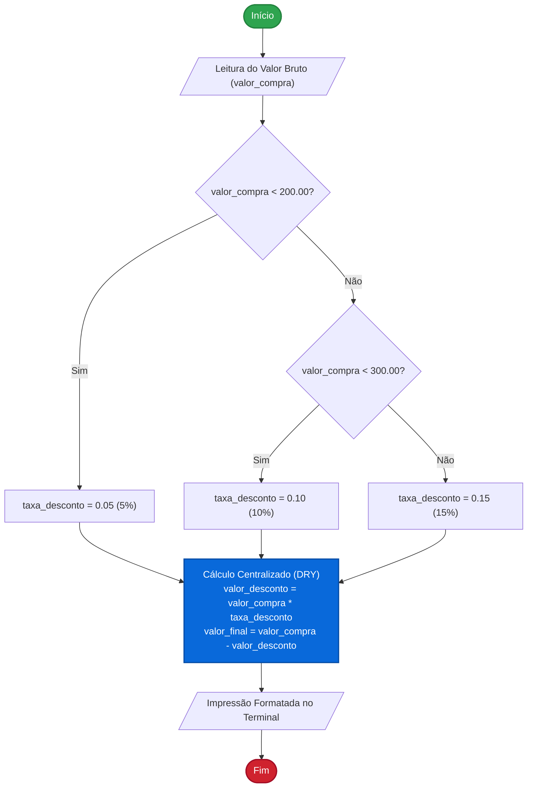

# Sistema de Desconto Progressivo para E-Commerce

[](https://www.python.org/)
[](https://git-scm.com/)
[]()
[](https://www.cps.sp.gov.br/)
[]()

---

## 📌 Visão Geral e Contexto

Este repositório contém a implementação de um motor determinístico de cálculo de **desconto progressivo** sobre transações de compras online. Desenvolvido como atividade prática da **Agenda 06** da disciplina de **Desenvolvimento de Sistemas I**, o projeto consolida conceitos fundamentais de computação e boas práticas de engenharia de software aplicados a estruturas condicionais e processamento de fluxos lineares.

A concessão de descontos progressivos é uma regra de negócio onipresente no comércio eletrônico, projetada para incentivar a expansão do tíquete médio (AOV - *Average Order Value*). A solução foca na clareza do encadeamento lógico, precisão numérica para valores monetários e separação formal entre captura, tomada de decisão, processamento aritmético e renderização de saída.

---

## 💼 Regras de Negócio e Tabela de Decisão

A política de incentivo escalona alíquotas percentuais progressivas de acordo com o montante bruto faturado. A tabela a seguir formaliza as condições lógicas que orientam o fluxo de decisão:

| Faixa de Preço (R$) | Condição Lógica (`if/elif/else`) | Alíquota de Desconto | Objetivo Comercial da Regra |
| :--- | :--- | :---: | :--- |
| **Abaixo de R$ 200,00** | `valor_compra < 200.00` | **5%** | Bonificação base de entrada para compras de baixo valor. |
| **R$ 200,00 até R$ 299,99** | `valor_compra < 300.00` | **10%** | Incentivo de retenção e elevação intermediária de tíquete médio. |
| **A partir de R$ 300,00** | `else` | **15%** | Recompensa máxima para fidelização e compras de alto volume. |

### Fluxo de Tomada de Decisão



---

## 🏛️ Destaques de Arquitetura e Engenharia de Software

O código foi arquitetado com base em princípios canônicos de *Clean Code*, otimização de fluxo de controle e manutenção sustentável:

### 1. Aplicação Rigorosa do Princípio DRY (*Don't Repeat Yourself*)
* **Abordagem Tradicional Ingênua:** É comum observar implementações em que as fórmulas aritméticas de desconto e subtração do valor final são duplicadas no corpo de cada cláusula condicional (`if`, `elif`, `else`), juntamente com chamadas redundantes de `print`.
* **Solução Implementada:** O bloco condicional atua estritamente como um **atribuidor de estado** (definindo unicamente `taxa_desconto`). Os cálculos aritméticos e a exibição de resultados são isolados downstream, sendo declarados **uma única vez** no programa:
  ```python
  # Processamento: cálculos centralizados fora da estrutura de decisão
  valor_desconto = valor_compra * taxa_desconto
  valor_final = valor_compra - valor_desconto
  ```
  Essa abordagem reduz a complexidade ciclomática, previne divergências aritméticas em manutenções futuras e facilita a testabilidade unitária.

### 2. Otimização Condicional e Eliminação de Redundâncias Lógicas
* Em estruturas encadeadas `if-elif-else`, a avaliação é estritamente sequencial e mutuamente exclusiva:
  - Ao atingir a linha `elif valor_compra < 300.00:`, o interpretador **já garantiu** que a expressão `valor_compra < 200.00` resultou em `False`.
  - Portanto, a verificação composta `elif valor_compra >= 200.00 and valor_compra < 300.00:` é desnecessária e redundante.
  - Sua eliminação reduz instruções de avaliação booleana, melhora a legibilidade sintática e simplifica o fluxo cognitivo de leitura do código.
  - Do mesmo modo, a cláusula `else` captura por exclusão todos os valores $\ge 300.00$, sem requerer checagens adicionais.

### 3. Separação de Responsabilidades e Tipagem Monetária
* **Input Stage:** Conversão explícita com `float(input(...))` para garantir precisão em operações de ponto flutuante.
* **Format Specification:** Utilização de *f-strings* modernas com especificador de precisão fixa (`:.2f`), assegurando conformidade com o padrão financeiro de duas casas decimais e alinhamento visual no console.

---

## 🧪 Matriz de Casos de Teste (*Boundary & Partition Tests*)

Para assegurar a robustez do algoritmo, aplicou-se a técnica de **Análise de Valores-Limite (*Boundary Value Analysis*)** combinada com **Particionamento por Equivalência**:

| Caso de Teste | Entrada (R$) | Classificação de Partição | Alíquota | Desconto Calculado | Total a Pagar | Justificativa Técnica do Teste de Fronteira |
| :---: | :---: | :--- | :---: | :---: | :---: | :--- |
| **TC-01** | `150.00` | Valor Nominal / Partição Inferior | 5% | R$ 7,50 | R$ 142,50 | Avalia o comportamento no ponto médio estável da faixa $]0, 200[$. |
| **TC-02** | `200.00` | **Fronteira Crítica 1 (Transição)** | 10% | R$ 20,00 | R$ 180,00 | Valida a condição estrita `< 200.00` (avalia `False`), ativando a faixa de 10%. |
| **TC-03** | `299.99` | Fronteira Superior (Faixa 2) | 10% | R$ 30,00 | R$ 269,99 | Limite superior imediato da segunda partição antes do salto de alíquota. |
| **TC-04** | `300.00` | **Fronteira Crítica 2 (Transição)** | 15% | R$ 45,00 | R$ 255,00 | Valida a condição estrita `< 300.00` (avalia `False`), direcionando ao `else` (15%). |
| **TC-05** | `500.00` | Valor Nominal / Partição Superior | 15% | R$ 75,00 | R$ 425,00 | Garante consistência em ordens de compra de maior volume financeiro. |

> [!TIP]
> Os casos **TC-02 (R$ 200,00)** e **TC-04 (R$ 300,00)** são os testes de maior criticidade, pois validam a ausência de desvios lógicos conhecidos como *Off-by-One Errors* decorrentes do uso correto do operador menor estrito (`<`).

---

## 🚀 Instruções de Execução

### Pré-requisitos

- **Python:** Versão `3.10+` (recomendado `3.14+`).
- **Terminal:** Bash, Zsh, PowerShell ou Prompt de Comando (CMD).

### Passos de Instalação e Execução

1. **Clone o repositório:**
   ```bash
   git clone https://github.com/gu1just1/etec-ds1-agenda06.git
   cd etec-ds1-agenda06
   ```

2. **Execute o script Python:**
   ```bash
   python GuilhermeJusti_Ag6_DS_I.py
   ```

### Demonstração de Saída no Terminal

Exemplo de execução real para o caso de teste de transição de fronteira (**TC-02: R$ 200,00**):

```text
Digite o valor total da compra (R$): 200.00
----------------------------------------
Taxa aplicada:      10%
Valor do desconto:  R$ 20.00
Total a pagar:      R$ 180.00
----------------------------------------
```

Exemplo para compra com alíquota máxima (**TC-04: R$ 300,00**):

```text
Digite o valor total da compra (R$): 300.00
----------------------------------------
Taxa aplicada:      15%
Valor do desconto:  R$ 45.00
Total a pagar:      R$ 255.00
----------------------------------------
```

---

## 📂 Estrutura de Arquivos

```text
etec-ds1-agenda06/
│
├── GuilhermeJusti_Ag6_DS_I.py   # Script principal contendo o algoritmo de desconto
└── README.md                    # Documentação técnica e guia de engenharia
```

---

## 👨‍💻 Metadados do Autor e Contexto Acadêmico

| Atributo | Detalhe |
| :--- | :--- |
| **Autor / Desenvolvedor** | **Guilherme Justi** |
| **Instituição** | ETEC / Centro Estadual de Educação Tecnológica Paula Souza (CPS) |
| **Curso** | Curso Técnico em Desenvolvimento de Sistemas |
| **Disciplina** | Desenvolvimento de Sistemas I |
| **Atividade** | Agenda 06 — Estruturas Condicionais e Algoritmos de Decisão |
| **Linguagem Principal** | Python |

---

<div align="center">
  <sub>Desenvolvido com foco em excelência técnica, clareza algorítmica e boas práticas de engenharia de software.</sub>
</div>